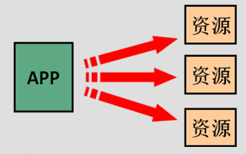

# Spring note
## 1 概述
### 1.1 什么是 Spring
```text
Spring是分层的 Java SE/EE应用 full-stack 轻量级开源框架，以 IoC（Inverse Of Control：
反转控制）和 AOP（Aspect Oriented Programming：面向切面编程）为内核，提供了展现层 Spring
MVC 和持久层 Spring JDBC 以及业务层事务管理等众多的企业级应用技术
```

### 1.2 spring 优势

#### 1.2.1 方便解耦，简化开发
```text
通过 Spring提供的 IoC容器，可以将对象间的依赖关系交由 Spring进行控制，避免硬编码所造
成的过度程序耦合。用户也不必再为单例模式类、属性文件解析等这些很底层的需求编写代码，可
以更专注于上层的应用。
```
#### 1.2.2 AOP 编程的支持
```text
通过 Spring的 AOP 功能，方便进行面向切面的编程，许多不容易用传统OOP 实现的功能可以
通过 AOP 轻松应付。
```
#### 1.2.3 声明式事务的支持
可以将我们从单调烦闷的事务管理代码中解脱出来，通过声明式方式灵活的进行事务的管理，
提高开发效率和质量。
方便程序的测试
可以用非容器依赖的编程方式进行几乎所有的测试工作，测试不再是昂贵的操作，而是随手可
做的事情。
#### 1.2.4 方便集成各种优秀框架
Spring可以降低各种框架的使用难度，提供了对各种优秀框架（Struts、Hibernate、Hessian、Quartz
等）的直接支持。
降低 JavaEE API 的使用难度
Spring对 JavaEE API（如 JDBC、JavaMail、远程调用等）进行了薄薄的封装层，使这些 API 的
使用难度大为降低。
#### 1.2.5 Java 源码是经典学习范例
Spring的源代码设计精妙、结构清晰、匠心独用，处处体现着大师对Java 设计模式灵活运用以
及对 Java技术的高深造诣。它的源代码无意是 Java 技术的最佳实践的范例。

## 2 IoC 的概念和作用
### 2.1 什么是程序的耦合
```text
耦合性(Coupling)，也叫耦合度，是对模块间关联程度的度量。耦合的强弱取决于模块间接口的复杂性、调
用模块的方式以及通过界面传送数据的多少。模块间的耦合度是指模块之间的依赖关系，包括控制关系、调用关
系、数据传递关系。模块间联系越多，其耦合性越强，同时表明其独立性越差( 降低耦合性，可以提高其独立
性)。耦合性存在于各个领域，而非软件设计中独有的，但是我们只讨论软件工程中的耦合。
在软件工程中，耦合指的就是就是对象之间的依赖性。对象之间的耦合越高，维护成本越高。因此对象的设计
应使类和构件之间的耦合最小。软件设计中通常用耦合度和内聚度作为衡量模块独立程度的标准。 划分模块的一个
准 则就是高内聚低耦合。
它有如下分类：
（1） 内容耦合。当一个模块直接修改或操作另一个模块的数据时，或一个模块不通过正常入口而转入另
一个模块时，这样的耦合被称为内容耦合。内容耦合是最高程度的耦合，应该避免使用之。
（2） 公共耦合。两个或两个以上的模块共同引用一个全局数据项，这种耦合被称为公共耦合。在具有大
量公共耦合的结构中，确定究竟是哪个模块给全局变量赋了一个特定的值是十分困难的。
（3） 外部耦合 。一组模块都访问同一全局简单变量而不是同一全局数据结构，而且不是通过参数表传
递该全局变量的信息，则称之为外部耦合。
（4） 控制耦合 。一个模块通过接口向另一个模块传递一个控制信号，接受信号的模块根据信号值而进
行适当的动作，这种耦合被称为控制耦合。
（5） 标记耦合 。若一个模块 A 通过接口向两个模块 B 和 C 传递一个公共参数，那么称模块 B 和 C 之间
存在一个标记耦合。
（6） 数据耦合。模块之间通过参数来传递数据，那么被称为数据耦合。数据耦合是最低的一种耦合形
式，系统中一般都存在这种类型的耦合，因为为了完成一些有意义的功能，往往需要将某些模块的输出数据作为另
一些模块的输入数据。
（7） 非直接耦合 。两个模块之间没有直接关系，它们之间的联系完全是通过主模块的控制和调用来实
现的。
总结：
耦合是影响软件复杂程度和设计质量的一个重要因素，在设计上我们应采用以下原则：如果模块间必须
存在耦合，就尽量使用数据耦合，少用控制耦合，限制公共耦合的范围，尽量避免使用内容耦合。
内聚与耦合
内聚标志一个模块内各个元素彼此结合的紧密程度，它是信息隐蔽和局部化概念的自然扩展。内聚是从
功能角度来度量模块内的联系，一个好的内聚模块应当恰好做一件事。它描述的是模块内的功能联系。耦合是软件
结构中各模块之间相互连接的一种度量，耦合强弱取决于模块间接口的复杂程度、进入或访问一个模块的点以及通
过接口的数据。 程序讲究的是低耦合，高内聚。就是同一个模块内的各个元素之间要高度紧密，但是各个模块之
间的相互依存度却要不那么紧密。
内聚和耦合是密切相关的，同其他模块存在高耦合的模块意味着低内聚，而高内聚的模块意味着该模块同其他
模块之间是低耦合。在进行软件设计时，应力争做到高内聚，低耦合。
``` 
### 2.2 解决程序耦合的思路(反射)
```text
当是我们讲解 jdbc 时，是通过反射来注册驱动的，代码如下：
Class.forName("com.mysql.jdbc.Driver");//此处只是一个字符串
此时的好处是，我们的类中不再依赖具体的驱动类，此时就算删除 mysql 的驱动 jar 包，依然可以编译（运
行就不要想了，没有驱动不可能运行成功的）。
同时，也产生了一个新的问题，mysql 驱动的全限定类名字符串是在 java 类中写死的，一旦要改还是要修改
源码。
解决这个问题也很简单，使用配置文件配置。
```
### 2.3 工厂模式解耦

```text
在实际开发中我们可以把三层的对象都使用配置文件配置起来，当启动服务器应用加载的时候，让一个类中的
方法通过读取配置文件，把这些对象创建出来 并存起来。在接下来的使用的时候，直接拿过来用就好了。
那么，这个读取配置文件，创建和获取三层对象的类就是工厂。
```

### 2.4 控制反转-Inversion Of Control
#### 2.4.1 存哪去？
```text
分析：由于我们是很多对象，肯定要找个集合来存。这时候有 Map 和 List 供选择。
到底选 Map 还是 List 就看我们有没有查找需求。有查找需求，选 Map。
所以我们的答案就是
在应用加载时，创建一个 Map，用于存放三层对象。
我们把这个 map 称之为 容器。
```
#### 2.4.1 什么是工厂？
工厂就是负责给我们从容器中获取指定对象的类。这时候我们获取对象的方式发生了改变。

```text
原来：
    我们在获取对象时，都是采用 new 的方式。是主动的。
```

```text
现在：
    我们获取对象时，同时跟工厂要，有工厂为我们查找或者创建对象。是被动的。
    这种被动接收的方式获取对象的思想就是控制反转，它是 spring 框架的核心之一。
    确
```


#### 2.4.2 控制反转
控制反转（Inversion of Control，缩写为IoC），是面向对象编程中的一种设计原则，可以用来减低计算机代码之间的耦合度。其中最常见的方式叫做依赖注入（Dependency Injection，简称DI），还有一种方式叫“依赖查找”（Dependency Lookup）

#### 2.4.3 明确 ioc 的作用
```text
削减计算机程序的耦合(解除我们代码中的依赖关系)。
```

## 3 Spring 基于 XML 的 IOC 细节
### 3.1 spring 中工厂的类结构图


#### 3.2.1 BeanFactory 和 ApplicationContext 

```text
BeanFactory 才是 Spring 容器中的顶层接口。
ApplicationContext 是它的子接口。
BeanFactory 和 ApplicationContext 的区别：
    创建对象的时间点不一样。
        ApplicationContext：只要一读取配置文件，默认情况下就会创建对象。
        BeanFactory：什么使用什么时候创建对象。
```

#### 3.2.2 ApplicationContext 接口的实现类

```text
ClassPathXmlApplicationContext ：
``它是从类的根路径下加载配置文件 推荐使用这种
FileSystemXmlApplicationContext ：
``它是从磁盘路径上加载配置文件，配置文件可以在磁盘的任意位置。
AnnotationConfigApplicationContext:
``当我们使用注解配置容器对象时，需要使用此类来创建 spring 容器。它用来读取注解。
```

### 3.2 IOC 中 bean 标签和管理对象细节
#### 3.2.1 bean 标签

```text
作用：
    用于配置对象让 spring 来创建的。
    默认情况下它调用的是类中的无参构造函数。如果没有无参构造函数则不能创建成功。
属性：
    id：给对象在容器中提供一个唯一标识。用于获取对象。
    class：指定类的全限定类名。用于反射创建对象。默认情况下调用无参构造函数。
    scope：指定对象的作用范围。
        取值范围:
            singleton :默认值，单例的.
            prototype :多例的.
            request  :WEB 项目中,Spring 创建一个 Bean 的对象,将对象存入到 request 域中.
            session  :WEB 项目中,Spring 创建一个 Bean 的对象,将对象存入到 session 域中.
            global session  :WEB 项目中,应用在 Portlet 环境.如果没有 Portlet 环境那么globalSession 相当于 session.
    init-method：指定类中的初始化方法名称。
    destroy-method：指定类中销毁方法名称。
```

#### 3.2.2 bean 的作用范围和生命周期 

```text
单例对象：scope="singleton"
    一个应用只有一个对象的实例。它的作用范围就是整个引用。
    生命周期：
        对象出生：当应用加载，创建容器时，对象就被创建了。
        对象活着：只要容器在，对象一直活着。
        对象死亡：当应用卸载，销毁容器时，对象就被销毁了。
多例对象：scope="prototype"
    每次访问对象时，都会重新创建对象实例。
    生命周期：
        对象出生：当使用对象时，创建新的对象实例。
        对象活着：只要对象在使用中，就一直活着。
        对象死亡：当对象长时间不用时，被 java 的垃圾回收器回收了。
```

#### 3.2.3 实例化 Bean 的三种方式

##### 3.2.3.1 方式一默认无参构造函数

```xml
<!--在默认情况下-->
<bean id="accountService" class="com.introduction.service.impl.AccountServiceImpl"/>
```
##### 3.2.3.2 方式二spring 管理静态工厂,使用静态工厂的方法创建对象

```java
/**
* 模拟一个静态工厂，创建业务层实现类
*/
public class StaticFactory { 
public static IAccountService createAccountService(){
return new AccountServiceImpl();
}
}
```
```xml
<!-- 此种方式是:
使用 StaticFactory 类中的静态方法 createAccountService 创建对象，并存入 spring 容器
id 属性：指定 bean 的 id，用于从容器中获取
class 属性：指定静态工厂的全限定类名
factory-method 属性：指定生产对象的静态方法
-->
<bean id="accountService" class="com.introduction.factory.StaticFactory" factory-method="createAccountService"></bean>
```

##### 3.2.3.2 方式三spring 管理实例工厂-使用实例工厂的方法创建对象

```java
/**
* 模拟一个实例工厂，创建业务层实现类
* 此工厂创建对象，必须现有工厂实例对象，再调用方法
*/
public class InstanceFactory {
public IAccountService createAccountService(){
return new AccountServiceImpl();
    }
}
```
```xml
<!-- 此种方式是：
先把工厂的创建交给 spring 来管理。
然后在使用工厂的 bean 来调用里面的方法
factory-bean 属性：用于指定实例工厂 bean 的 id。
factory-method 属性：用于指定实例工厂中创建对象的方法。
-->
<bean id="instancFactory" class="com.introduction.factory.InstanceFactory"></bean>
<bean id="accountService" factory-bean="instancFactory" factory-method="createAccountService"></bean>
```

### 3.3 spring 的依赖注入

#### 3.3.1 依赖注入的概念
依赖注入：Dependency Injection。它是 spring 框架核心 ioc 的具体实现。
我们的程序在编写时，通过控制反转，把对象的创建交给了 spring，但是代码中不可能出现没有依赖的情况。
ioc 解耦只是降低他们的依赖关系，但不会消除。例如：我们的业务层仍会调用持久层的方法。
那这种业务层和持久层的依赖关系，在使用 spring 之后，就让 spring 来维护了。
简单的说，就是坐等框架把持久层对象传入业务层，而不用我们自己去获取。

#### 示例类:
```java
public class AccountServiceImpl4 implements IAccountService {
    private String name;
    private Integer age;
    private Date birthday;
    
    public AccountServiceImpl4(){}
    
    public AccountServiceImpl4(String name, Integer age, Date birthday){
        this.name = name;
        this.age = age;
        this.birthday = birthday;
    }
    
    public void setName(String name) {
    this.name = name;
    }
    public void setAge(Integer age) {
    this.age = age;
    }
    public void setBirthday(Date birthday) {
    this.birthday = birthday;
    }
    @Override
    public void saveAccount() {
    System.out.println(name+","+age+","+birthday);
    }
}
```

#### 3.3.2 构造函数注入
顾名思义，就是使用类中的构造函数，给成员变量赋值。注意，赋值的操作不是我们自己做的，而是通过配置
的方式，让 spring 框架来为我们注入。具体代码如下：
```xml
<!-- 使用构造函数的方式，给 service 中的属性传值
    要求：
        类中需要提供一个对应参数列表的构造函数。
    涉及的标签：
        constructor-arg
    属性：
        index:指定参数在构造函数参数列表的索引位置
        type:指定参数在构造函数中的数据类型
        name:指定参数在构造函数中的名称 用这个找给谁赋值
    =======上面三个都是找给谁赋值，下面两个指的是赋什么值的==============
    value:它能赋的值是基本数据类型和 String 类型
    ref:它能赋的值是其他 bean 类型，也就是说，必须得是在配置文件中配置过的 bean
-->
<bean id="accountService" class="com.instroduction.service.impl.AccountServiceImpl">
<constructor-arg name="name" value=" 张三 "></constructor-arg>
<constructor-arg name="age" value="18"></constructor-arg>
<constructor-arg name="birthday" ref="now"></constructor-arg>
</bean>
<bean id="now" class="java.util.Date"></bean>
```

#### 3.3.3 set 方法注入
顾名思义，就是在类中提供需要注入成员的 set 方法。具体代码如下：
```xml
<!-- 通过配置文件给 bean 中的属性传值：使用 set 方法的方式
    涉及的标签：
        property
    属性：
        name：找的是类中 set 方法后面的部分
        ref：给属性赋值是其他 bean 类型的
        value：给属性赋值是基本数据类型和 string 类型的
    实际开发中，此种方式用的较多。
-->
<bean id="accountService" class="com.insrtoduction.service.impl.AccountServiceImpl">
    <property name="name" value="test"></property>
    <property name="age" value="21"></property>
    <property name="birthday" ref="now"></property>
</bean>
<bean id="now" class="java.util.Date"></bean>
```
#### 3.3.4 使用 p 名称空间注入数据（本质还是调用 set 方法）
此种方式是通过在 xml中导入 p名称空间，使用 p:propertyName 来注入数据，它的本质仍然是调用类中的
set 方法实现注入功能。
```xml
<beans xmlns="http://www.springframework.org/schema/beans"
    xmlns:p="http://www.springframework.org/schema/p"
    xmlns:xsi="http://www.w3.org/2001/XMLSchema-instance"
    xsi:schemaLocation=" http://www.springframework.org/schema/beans
    http://www.springframework.org/schema/beans/spring-beans.xsd">
    
    <bean id="accountService"class="com.instroduction.service.impl.AccountServiceImpl"
    p:name="test" p:age="21" p:birthday-ref="now"/>
    
</beans>
```
#### 3.3.5 注入集合属性
顾名思义，就是给类中的集合成员传值，它用的也是set方法注入的方式，只不过变量的数据类型都是集合。
我们这里介绍注入数组，List,Set,Map,Properties。具体代码如下：
```java
public class AccountServiceImpl implements IAccountService {
    private String[] myStrs;
    private List<String> myList;
    private Set<String> mySet;
    private Map<String,String> myMap;
    private Properties myProps;
    public void setMyStrs(String[] myStrs) {
    this.myStrs = myStrs;
    }
    public void setMyList(List<String> myList) {
    this.myList = myList;
    }
    public void setMySet(Set<String> mySet) {
    this.mySet = mySet;
    }
    public void setMyMap(Map<String, String> myMap) {
    this.myMap = myMap;
    }
    public void setMyProps(Properties myProps) {
    this.myProps = myProps;
    }
    @Override
    public void saveAccount() {
    System.out.println(Arrays.toString(myStrs));
    System.out.println(myList);
    System.out.println(mySet);
    System.out.println(myMap);
    System.out.println(myProps);
    }
}
```
```xml
<!-- 注入集合数据
    List 结构的：
    array,list,set
    Map 结构的
    map,entry,props,prop
-->
<bean id="accountService" class="com.instroduction.service.impl.AccountServiceImpl">
    <!-- 在注入集合数据时，只要结构相同，标签可以互换 -->
    <!-- 给数组注入数据 -->
    <property name="myStrs">
    <set>
        <value>AAA</value>
        <value>BBB</value>
        <value>CCC</value>
    </set>
    </property>
    <!-- 注入 list 集合数据 -->
    <property name="myList">
        <array>
            <value>AAA</value>
            <value>BBB</value>
            <value>CCC</value>
        </array>
    </property>
    <!-- 注入 set 集合数据 -->
    <property name="mySet">
        <list>
            <value>AAA</value>
            <value>BBB</value>
            <value>CCC</value>
        </list>
    </property>
    <!-- 注入 Map 数据 -->
    <property name="myMap">
        <props>
            <prop key="testA">aaa</prop>
            <prop key="testB">bbb</prop>
        </props>
    </property>
    <!-- 注入 properties 数据 -->
    <property name="myProps">
        <map>
            <entry key="testA" value="aaa"></entry>
            <entry key="testB">
            <value>bbb</value>
        </entry>
        </map>
    </property>
</bean>
```
## 4 Spring 快速入门
### 4.1 注入依赖
- spring-beans
- spring-core
- spring-exprssion
- spring-context
### 4.2 创建 spring-config.xml 并配置
```xml
<?xml version="1.0" encoding="UTF-8"?>
<beans xmlns="http://www.springframework.org/schema/beans"
       xmlns:xsi="http://www.w3.org/2001/XMLSchema-instance"
       xmlns:context="http://www.springframework.org/schema/context"
       xmlns:p="http://www.springframework.org/schema/p"
       xsi:schemaLocation="http://www.springframework.org/schema/beans http://www.springframework.org/schema/beans/spring-beans.xsd
       http://www.springframework.org/schema/context  http://www.springframework.org/schema/context/spring-context.xsd">

    <!--组件扫描-->
    <context:component-scan base-package="cn.instroduction.service" />
    <context:component-scan base-package="cn.instroduction.dao" />
</beans>
```
### 4.3 测试
```java
public class ClientTest {
    public static void main(String[] args) throws IllegalAccessException, InstantiationException, ClassNotFoundException, IOException {
        /*创建 spring 容器对象*/
        ApplicationContext context = new ClassPathXmlApplicationContext("spring-config.xml");
        /*使用 getBean 方法获取具体实体*/
        IAccountDao accountDao = (IAccountDao)context.getBean("accountDao");
        System.out.println(accountDao);
    }
}
```

## 5 常用注解
### 5.1 创建对象
```text
相当于：<bean id="" class="">
```
#### 5.1.1 @Component
```text
作用：
    把资源让 spring 来管理。相当于在 xml 中配置一个 bean。
属性：
    value：指定 bean 的 id。如果不指定 value 属性，默认 bean 的 id 是当前类的类名。首字母小写。
```
#### 5.1.2 @Controller @Service @Repository
```text
他们三个注解都是针对一个的衍生注解，他们的作用及属性都是一模一样的。
他们只不过是提供了更加明确的语义化。
    @Controller ：一般用于表现层的注解。
    @Service ：一般用于业务层的注解。
    @Repository ：一般用于持久层的注解。
细节：如果注解中有且只有一个属性 要赋值时是 ，且名称是 value ，value  在赋值是可以不写
```
### 5.2 创建对象
```text
相当于：<property name="" ref="">
<property name="" value="">
```
#### 5.2.1 @Autowired
```text
作用：
    自动按照类型注入。当使用注解注入属性时，set方法可以省略。它只能注入其他 bean 类型。当有多个
    类型匹配时，使用要注入的对象变量名称作为 bean 的 id，在 spring 容器查找，找到了也可以注入成功。找不到
    就报错。
```

#### 5.2.2 @Qualifier
```text
作用：
    在自动按照类型注入的基础之上，再按照 Bean 的 id 注入。它在给字段注入时不能独立使用，必须和
    @Autowire 一起使用；但是给方法参数注入时，可以独立使用。
属性：
    value：指定 bean 的 id。
```
#### 5.2.3 @Resource
```text
作用：
    直接按照 Bean 的 id 注入。它也只能注入其他 bean 类型。
属性：
    name：指定 bean 的 id
```

#### 5.2.4 @Resource
```text
作用：
    注入基本数据类型和 String 类型数据的
属性：
    value：用于指定值
```

### 5.3 改变作用范围
```text
相当于：<bean id="" class="" scope="">
```
#### 5.3.1 @Scope
```text
作用：
    指定 bean 的作用范围。
属性：
    value：指定范围的值。
取值：
    singleton prototype request session globalsession
```

### 5.4 生命周期相关
```text
相当于：<bean id="" class="" init-method="" destroy-method="" />
```
#### 5.4.1 @PostConstruct
```text
作用：
``用于指定初始化方法。
```
#### 5.4.3 @PreDestroy
```text
作用：
    用于指定销毁方法。
```
### 5.5 Spring 注解和 XML  的选择
#### 5.5.1 注解的优势
配置简单，维护方便（我们找到类，就相当于找到了对应的配置）。
#### 5.5.2 XML 的优势
修改时，不用改源码。不涉及重新编译和部署。
#### 5.5.3 Spring  管理 Bean  方式的比较


### 5.6 spring 管理对象细节
```text
基于注解的 spring IoC 配置中，bean 对象的特点和基于 XML 配置是一模一样的。
```

### 5.7 spring 的纯注解配置
### 示例代码
```java
@Configuration
@ComponentScans({@ComponentScan("cn.springtx")})
@PropertySource("classpath:jdbc.properties")
@Import({JdbcConfiguration.class, TransactionConfiguration.class})
@EnableTransactionManagement
public class SpringConfiguration {
}

============================================
public class JdbcConfiguration {

    @Value("${jdbc.driverClass}")
    private String driverClass;

    @Value("${jdbc.url}")
    private String url;

    @Value("${jdbc.user}")
    private String user;

    @Value("${jdbc.password}")
    private String password;

    @Bean(name="jx")
    public JdbcTemplate getJdbcTemplate(@Qualifier("dataSource") DataSource dataSource){
        return new JdbcTemplate(dataSource);
    }

    @Bean(name="dataSource")
    public DataSource getDataSource(){
        ComboPooledDataSource ds = null;
        try {
            ds = new ComboPooledDataSource();
            ds.setDriverClass(driverClass);
            ds.setJdbcUrl(url);
            ds.setUser(user);
            ds.setPassword(password);
        } catch (PropertyVetoException e) {
            e.printStackTrace();
        }
        return ds;
    }

}
```
#### 5.7.1 @Configuration
```text
作用：
    用于指定当前类是一个 spring 配置类，当创建容器时会从该类上加载注解。获取容器时需要使用
    AnnotationApplicationContext(有@Configuration 注解的类.class)。
属性：
    value:用于指定配置类的字节码
```
#### 5.7.2 @ComponentScan
```text
作用：
    用于指定 spring 在初始化容器时要扫描的包。作用和在 spring 的 xml 配置文件中的：
    <context:component-scan base-package="com.itheima"/>是一样的。
属性：
    basePackages：用于指定要扫描的包。和该注解中的 value 属性作用一样。
```
#### 5.7.3 @Bean
```text
作用：
    该注解只能写在方法上，表明使用此方法创建一个对象，并且放入 spring 容器。
属性：
    name：给当前@Bean 注解方法创建的对象指定一个名称(即 bean 的 id）。
```
示例代码：
#### 5.7.4 @PropertySource
```text
作用：
    用于加载.properties 文件中的配置。例如我们配置数据源时，可以把连接数据库的信息写到
    properties 配置文件中，就可以使用此注解指定 properties 配置文件的位置。
属性：
    value[]：用于指定 properties 文件位置。如果是在类路径下，需要写上 classpath:
```
#### 5.7.5 @Import
```text
作用：
    用于导入其他配置类，在引入其他配置类时，可以不用再写@Configuration 注解。当然，写上也没问题。
属性：
    value[]：用于指定其他配置类的字节码。
```
#### 5.7.6 通过注解获取容器 
```java
ApplicationContext ac =
new AnnotationConfigApplicationContext(SpringConfiguration.class);
```
## 6 Spring 整合 Junit

### 6.1 加入依赖
- spring-test
### 6.2 使用
```java
@RunWith(SpringJUnit4ClassRunner.class)
@ContextConfiguration(locations = {"classpath:spring-springtx.xml"})
//@ContextConfiguration(classes = {config.SpringConfiguration.class})
public class Client {
}
```

## 7 AOP 概述
### 7.1 什么是 AOP ?
AOP：全称是 Aspect Oriented Programming 即：面向切面编程。
简单的说它就是把我们程序重复的代码抽取出来，在需要执行的时候，使用动态代理的技术，在不修改源码的
基础上，对我们的已有方法进行增强。

### 7.2 AOP 的作用及优势
```text
作用：
    在程序运行期间，不修改源码对已有方法进行增强。
优势：
    减少重复代码
    提高开发效率
    维护方便
```
### 7.3 AOP 的实现方式

动态代理

### 7.4 AOP 具体应用

#### 7.4.1 使用动态代理实现业务层中的事务控制

#### 7.4.2 示例
##### 7.4.2.1 BeanFactory 代理对象
```java
/**
* service 的代理工厂
*/
public class BeanFactory {

   private IAccountService accountService;
   
   private TransationManager tx;

   public void setAccountService(IAccountService accountService) {
       this.accountService = accountService;
   }

   public void setTx(TransationManager tx) {
       this.tx = tx;
   }

   public IAccountService getAccountService(){
       return (IAccountService)Proxy.newProxyInstance(accountService.getClass().getClassLoader(), accountService.getClass().getInterfaces(), new InvocationHandler() {
           @Override
           public Object invoke(Object proxy, Method method, Object[] args) throws Throwable {
               Object obj = null;
               try {
                   tx.beginTransaction(); // 开始事务
                   obj = method.invoke(accountService, args);
                   tx.commit(); // 提交事务
               } catch (Exception e) {
                   tx.rollback(); // 回滚事务
               } finally {
                   tx.release(); // 释放资源
               }
               return obj;
           }
       });
   }
}
```

##### 7.4.2.2 TransationManager 事务管理器
```java
/**
 * 事务管理器
 */
public class TransationManager {

    @Autowired
    private ConnectionUtil connUtil;

    @Pointcut("execution(* cn.transaction.dao.impl.*.*(..))")
    public void tx2(){}

    public void setConn(ConnectionUtil connUtil) {
        this.connUtil = connUtil;
    }

    /*开启事务*/
    public void beginTransaction(){
        try{
            System.out.println("beginTransaction...");
            connUtil.getThreadConnection().setAutoCommit(false);
        }catch (Exception e){
            throw new RuntimeException(e);
        }
    }
    
  /*提交事务*/
    public void commit(){
        try{
            connUtil.getThreadConnection().commit();
        }catch (Exception e){
            throw new RuntimeException(e);
        }
    }
    /*回滚事务*/
    public void rollback(){
        try{
            connUtil.getThreadConnection().rollback();
        }catch (Exception e){
            throw new RuntimeException(e);
        }
    }

    /*释放资源*/
    public void release(){
        try{
            connUtil.getThreadConnection().close();
            connUtil.removeConnection();
        }catch (Exception e){
            throw new RuntimeException(e);
        }
    }
}
```
##### 7.4.2.3 ConnectionUtil 连接工具类(Singleton)

```java
/**
 * 连接工具类
 * 使其只有一个连接
 */
@Component("connUtil")
public class ConnectionUtil {

    private ThreadLocal<Connection> tl = new ThreadLocal<>();
    private Connection conn = null;
    @Autowired
    private DataSource dataSource;

    public void setDataSource(DataSource dataSource) {
        this.dataSource = dataSource;
    }

    /*把连接与线程绑定*/
    public Connection getThreadConnection(){
        try {
            conn = tl.get();
            if(conn == null){
                conn = dataSource.getConnection();
                tl.set(conn);
            }
        }catch (Exception e){
            e.printStackTrace();
            throw new RuntimeException("连接异常!");
        }
        return conn;
    }
    /*把连接与线程解绑*/
    public void removeConnection(){
        tl.remove();
    }
}
```
##### 7.4.2.4 将代理对象注入 Spring 容器
```text
<bean id="connUtil" class="cn.transaction.utils.ConnectionUtil">
    <property name="dataSource" ref="dataSource"/>
</bean>

<bean id="tx" class="cn.transaction.transaction.TransationManager">
    <property name="conn" ref="connUtil"/>
</bean>-->

<!--<bean id="beanFactory" class="cn.transaction.proxy.BeanFactory">
    <property name="accountService" ref="accountService"/>
    <property name="tx" ref="tx"/>
</bean>
```
### 7.5 动态代理
#### 7.5.1 动态代理的特点
字节码随用随创建，随用随加载。
它与静态代理的区别也在于此。因为静态代理是字节码一上来就创建好，并完成加载。
装饰者模式就是静态代理的一种体现。

#### 7.5.2 动态代理常用的有两种方式
```text
基于接口的动态代理
    提供者：JDK 官方的 Proxy 类。
    要求：被代理类最少实现一个接口。
基于子类的动态代理
    提供者：第三方的 CGLib，如果报 asmxxxx 异常，需要导入 asm.jar。
    要求：被代理类不能用 final 修饰的类（最终类）。
```
#### 7.5.2.1 JDK Proxy 类创建代理对象
```java
/**
 * 一个经纪公司的要求:
 * 能做基本的表演和危险的表演
 */
public interface IActor {
    void basicActor(double money);

    String dangerActor(double money);

    /**
     * 实现了接口，就表示具有接口中的方法实现。即：符合经纪公司的要求
     */
    class Actor implements IActor{

        @Override
        public void basicActor(double money) {
            System.out.println("basicActor演出费:" + money );
        }

        @Override
        public String dangerActor(double money) {
            System.out.println("dangerActor演出费:" + money );
            return "aqqje";
        }
    }

    // 一个剧情
    public static void main(String[] args) {
        /**
         * 代理：
         * 间接。
         * 获取代理对象：
         * 要求：
         * 被代理类最少实现一个接口
         * 创建的方式
         * Proxy.newProxyInstance(三个参数)
         * 参数含义：
         * ClassLoader：和被代理对象使用相同的类加载器。
         * Interfaces：和被代理对象具有相同的行为。实现相同的接口。
         * InvocationHandler：如何代理。
         * 策略模式：使用场景是：
         * 数据有了，目的明确。
         * 如何达成目标，就是策略。
         *
         */
        IActor actor = (IActor) Proxy.newProxyInstance(Actor.class.getClassLoader(), Actor.class.getInterfaces(), new InvocationHandler() {
            /**
             * 执行被代理对象的任何方法，都会经过该方法。
             * 此方法有拦截的功能。
             *
             * 参数：
             * proxy：代理对象的引用。不一定每次都用得到
             * method：当前执行的方法对象
             * args：执行方法所需的参数
             * 返回值：
             * 当前执行方法的返回值
             */
            @Override
            public Object invoke(Object proxy, Method method, Object[] args) throws Throwable {
                Object obj = null;
                Double money = (Double) args[0];
                String methodName = method.getName();
                if ("basicActor".equals(methodName)) {
                    obj = method.invoke(Actor.class.newInstance(), money + 111);
                } else {
                    obj = method.invoke(Actor.class.newInstance(), money + 222);
                }
                return obj;
            }
        });

        actor.basicActor(100);
        System.out.println(actor.dangerActor(100));;
    }
}
```
#### 7.5.2.2 CGLib 的 Enhancer类创建代理对象

```java
public class Actor {

    public void basicActor(double money) {
        System.out.println("basicActor演出费:" + money );
    }

    public String dangerActor(double money) {
        System.out.println("dangerActor演出费:" + money );
        return "aqqje11111";
    }

    public static void main(String[] args) {
        /**
         * 基于子类的动态代理
         * 要求：
         * 被代理对象不能是最终类
         * 用到的类：
         * Enhancer
         * 用到的方法：
         * create(Class, Callback)
         * 方法的参数：
         * Class：被代理对象的字节码
         * Callback：如何代理
         * @param args
         */
        Actor actor = (Actor)Enhancer.create(Actor.class, new MethodInterceptor() {
            /**
             * 执行被代理对象的任何方法，都会经过该方法。在此方法内部就可以对被代理对象的任何方法进行增强。
             * 参数：
             * 前三个和基于接口的动态代理是一样的。
             * MethodProxy：当前执行方法的代理对象。
             * 返回值：
             * 当前执行方法的返回值
             */
            @Override
            public Object intercept(Object o, Method method, Object[] objects, MethodProxy methodProxy) throws Throwable {
                Object obj = null;
                String methodName = method.getName();
                double money = (double) objects[0];
                if ("dangerActor".equals(methodName)) {
                    obj = method.invoke(Actor.class.newInstance(), money + 500);
                } else {
                    obj = method.invoke(Actor.class.newInstance(), money + 100);
                }
                return obj;
            }
        });

        actor.basicActor(100);
        System.out.println(actor.dangerActor(100));;
    }

}
```
## 8 Spring 中的 AOP

### 8.1 Spring 中 AOP 的细节
#### 8.1.1 AOP 相关术语
#### 8.1.1.1 Joinpoint( 连接点):
所谓连接点是指那些被拦截到的点。在 spring 中,这些点指的是方法,因为 spring 只支持方法类型的
连接点。

#### 8.1.1.2 Pointcut( 切入点):
所谓切入点是指我们要对哪些 Joinpoint 进行拦截的定义。

#### 8.1.1.3 Advice( 通知/ 增强):
所谓通知是指拦截到 Joinpoint 之后所要做的事情就是通知。
通知的类型：前置通知,后置通知,异常通知,最终通知,环绕通知。

#### 8.1.1.4 Introduction( 引介):
引介是一种特殊的通知在不修改类代码的前提下, Introduction 可以在运行期为类动态地添加一些方
法或 Field。

#### 8.1.1.5Target( 目标对象):
代理的目标对象。

#### 8.1.1.6 Weaving( 织入):
是指把增强应用到目标对象来创建新的代理对象的过程。
spring 采用动态代理织入，而 AspectJ 采用编译期织入和类装载期织入。

#### 8.1.1.7 Proxy （代理）:
一个类被 AOP 织入增强后，就产生一个结果代理类。

#### 8.1.1.8 Aspect( 切面):
是切入点和通知（引介）的结合。

### 8.2 具体应用

#### 8.2.2 加入依赖
- aoplliance
- aspectjweaver
- spring-aop
- spring-aspects
#### 8.2.3 spring aop 名称标签
##### 8.2.3.1 aop:config 
```text
作用：
    用于声明开始 aop 的配置
```
##### 8.2.3.2 aop:aspect 
```text
作用：
    用于配置切面。
属性：
    id：给切面提供一个唯一标识。
    ref：引用配置好的通知类 bean 的 id。
```
##### 8.2.3.3 aop:pointcut
```text
作用：
    用于配置切入点表达式。就是指定对哪些类的哪些方法进行增强。
属性：
    expression：用于定义切入点表达式。
    id：用于给切入点表达式提供一个唯一标识
```
##### 8.2.3.4 aop:before
```text
作用：
    用于配置前置通知。指定增强的方法在切入点方法之前执行
属性：
    method:用于指定通知类中的增强方法名称
    ponitcut-ref：用于指定切入点的表达式的引用
    poinitcut：用于指定切入点表达式 
执行时间点：
    切入点方法执行之前执行
```
##### 8.2.3.5 aop:after-returning
```text
作用：
    用于配置后置通知
属性：
    method ：指定通知中方法的名称。
    pointct ：定义切入点表达式
    pointcut-ref ：指定切入点表达式的引用
执行时间点：
    切入点方法正常执行之后。它和异常通知只能有一个执行
```
##### 8.2.3.6 aop:after-throwing
```text
作用：
    用于配置异常通知
属性：
    method ：指定通知中方法的名称。
    pointct ：定义切入点表达式
    pointcut-ref ：指定切入点表达式的引用
执行时间点：
    切入点方法执行产生异常后执行。它和后置通知只能执行一个
```
##### 8.2.3.7 aop:after
```text
作用：
    用于配置最终通知
属性：
    method ：指定通知中方法的名称。
    pointct ：定义切入点表达式
    pointcut-ref ：指定切入点表达式的引用
执行时间点：
    无论切入点方法执行时是否有异常，它都会在其后面执行。
```
##### 8.2.3.8 aop:around
```text
作用：
    用于配置环绕通知
属性：
    method：指定通知中方法的名称。
    pointct：定义切入点表达式
    pointcut-ref：指定切入点表达式的引用
说明：它是 spring 框架为我们提供的一种可以在代码中手动控制增强代码什么时候执行的方式。
注意：通常情况下，环绕通知都是独立使用的
```

#### 8.2.4 切入点表达式
```text
execution:匹配方法的执行(常用)
    execution(表达式)
        表达式语法：execution([修饰符] 返回值类型 包名.类名.方法名(参数))
写法说明：
    全匹配方式：
        public void com.springaop.service.impl.AccountServiceImpl.saveAccount(com.itheima.domain.Account)
    
    访问修饰符可以省略
        void com.springaop.service.impl.AccountServiceImpl.saveAccount(com.itheima.domain.Account)
    
    返回值可以使用*号，表示任意返回值
        * com.springaop.service.impl.AccountServiceImpl.saveAccount(com.itheima.domain.Account)
    
    包名可以使用*号，表示任意包，但是有几级包，需要写几个*
        * *.*.*.*.AccountServiceImpl.saveAccount(com.itheima.domain.Account)
    
    使用..来表示当前包，及其子包
        * com..AccountServiceImpl.saveAccount(com.itheima.domain.Account)
    
    类名可以使用*号，表示任意类
        * com..*.saveAccount(com.itheima.domain.Account)
    
    方法名可以使用*号，表示任意方法
        * com..*.*( com.itheima.domain.Account)
    
    参数列表可以使用*，表示参数可以是任意数据类型，但是必须有参数
        * com..*.*(*)
    
    参数列表可以使用..表示有无参数均可，有参数可以是任意类型
        * com..*.*(..)
    全通配方式：
        * *..*.*(..)
注：通常情况下，我们都是对业务层的方法进行增强，所以切入点表达式都是切到业务层实现类。execution(* com.springaop.service.impl.*.*(..))
```
#### 8.2.5 示例
```xml
  <!--aop-->
    <aop:config>
        <!--配置切面-->
        <aop:aspect id="logAdvice" ref="logger">
            <aop:before method="before" pointcut-ref="daoPointcut"/>
            <aop:after-returning method="afterReturning" pointcut-ref="daoPointcut"/>
            <aop:after-throwing method="afterThrowing" pointcut-ref="daoPointcut"/>
            <aop:after method="after" pointcut-ref="daoPointcut"/>
            <!--<aop:around method="around" pointcut-ref="daoPointcut"/>-->
            <aop:pointcut id="daoPointcut" expression="execution( * cn.springaop.dao.Impl.*.*(..) )"/>
        </aop:aspect>
    </aop:config>
```

### 8.2 基于注解的 AOP 配置注解说明

#### 8.2.1 @Aspect
```text
作用：
    把当前类声明为切面类。
```
#### 8.2.2 @Before
```text
作用：
    把当前方法看成是前置通知。
属性：
    value：用于指定切入点表达式，还可以指定切入点表达式的引用
```

#### 8.2.3 @AfterReturning
```text
作用：
    把当前方法看成是后置通知。
属性：
    value：用于指定切入点表达式，还可以指定切入点表达式的引用
```

#### 8.2.4 @AfterThrowing
```text
作用：
    把当前方法看成是异常通知。
属性：
    value：用于指定切入点表达式，还可以指定切入点表达式的引用
```

#### 8.2.5 @After
```text
作用：
    把当前方法看成是最终通知。
属性：
    value：用于指定切入点表达式，还可以指定切入点表达式的引用
```

#### 8.2.6 @Around
```text
作用：
    把当前方法看成是环绕通知。
属性：
    value：用于指定切入点表达式，还可以指定切入点表达式的引用。
```


#### 8.2.7 @Pointcut
```text
作用：
    指定切入点表达式
属性：
    value：指定表达式的内容
```
### 8.3 基于注解的 AOP 示例

#### 8.3.1 xml 方式开启注解 AOP 
```xml
<aop:aspectj-autoproxy/>
```
#### 8.3.1-1 注解 方式开启注解 AOP 
```java
@Configuration
@ComponentScan(basePackages="com.springaop")
@EnableAspectJAutoProxy
public class SpringConfiguration {
}
```
#### 8.3.2 日志类
```java
@Component("logger")
@Aspect // 表示这一个切面
public class Logger {

    @Pointcut("execution( * cn.springaop.dao.Impl.*.*(..) )") // 表示一个切点
    public void pt1(){}

    /*前置通知*/
    @Before("pt1()")
    public void before(){
        System.out.println("prelogger.........");
    }
    /*后置通知*/
    @AfterReturning("pt1()")
    public void afterReturning(){
        System.out.println("afterReturning.........");
    }
    @AfterThrowing("pt1()")
    /*异常通知*/
    public void afterThrowing(){
        System.out.println("afterThrowing.........");
    }
    @After("pt1()")
    /*最终通知*/
    public void after(){
        System.out.println("after.........");
    }

    /**
     * 环绕通知
     * 问题：
     *      当我们配置了环绕通知之后，切入点方法没有执行，而通知方法执行了。
     * 分析：
     *      通过对比动态代理中的环绕通知代码，发现动态代理的环绕通知有明确的切入点方法调用，而我们的代码中没有。
     * 解决：
     *      Spring框架为我们提供了一个接口：ProceedingJoinPoint。该接口有一个方法proceed()，此方法就相当于明确调用切入点方法。
     *      该接口可以作为环绕通知的方法参数，在程序执行时，spring框架会为我们提供该接口的实现类供我们使用。
     *
     * spring中的环绕通知：
     *      它是spring框架为我们提供的一种可以在代码中手动控制增强方法何时执行的方式。
     */

//    @Around("pt1()")
    public Object around(ProceedingJoinPoint pjp){
        Object obj = null;
        try {
            System.out.println("around.........前置");
            Object[] args = pjp.getArgs();
            obj = pjp.proceed();// 明确调用业务层方法,(切入点方法)
            System.out.println("around.........后置");
        } catch (Throwable throwable) {
            throwable.printStackTrace();
            System.out.println("around.........异常");
        }finally {
            System.out.println("around.........最终");
        }
        return obj;
    }
}
```

## 9 Spring 中的 JdbcTemplate
### 9.1 概述 
```text
它是 spring 框架中提供的一个对象，是对原始 Jdbc API 对象的简单封装。spring 框架为我们提供了很多
的操作模板类。
操作关系型数据的：
    JdbcTemplate
    HibernateTemplate
操作 nosql 数据库的：
    RedisTemplate
操作消息队列的：
    JmsTemplate
```
### 9.2 创建 jdbcTemplate 对象需要数据源
- 源码:
```java
public JdbcTemplate() {
}
public JdbcTemplate(DataSource dataSource) {
setDataSource(dataSource);
afterPropertiesSet();
}
public JdbcTemplate(DataSource dataSource, boolean lazyInit) {
setDataSource(dataSource);
setLazyInit(lazyInit);
afterPropertiesSet();
}
```
### 9.3 配置数据源的三种数据源
#### 9.3.1 c3p0 连接池
```xml
<bean id="dataSource" class="com.mchange.v2.c3p0.ComboPooledDataSource">
    <property name="driverClass" value="com.mysql.jdbc.Driver"/>
    <property name="jdbcUrl" value="jdbc:mysql:///mybaties?useUnicode=true&amp;charaterEncoding=utf-8"/>
    <property name="user" value="root"/>
    <property name="password" value="root"/>
</bean>
```

#### 9.3.2 dbcp 连接池
```xml
<bean id="dataSource" class="org.apache.commons.dbcp.BasicDataSource">
    <property name="driverClassName" value="com.mysql.jdbc.Driver"/>
    <property name="url" value="jdbc:mysql:///mybaties?useUnicode=true&amp;charaterEncoding=utf-8"/>
    <property name="username" value="root"/>
    <property name="password" value="root"/>
</bean>
```
#### 9.3.2 Spring 内置连接池
```xml
<bean id="dataSource" class="org.springframework.jdbc.datasource.DriverManagerDataSource">
    <property name="driverClassName" value="com.mysql.jdbc.Driver"/>
    <property name="url" value="jdbc:mysql:///mybaties?useUnicode=true&amp;charaterEncoding=utf-8"/>
    <property name="username" value="root"/>
    <property name="password" value="root"/>
</bean>
```

### 9.4 spring xml 加载 properties 文件的两种方式
#### 9.4.1 使用 PropertyPlaceholderConfigurer 类加载文件
```xml
<bean class="org.springframework.beans.factory.config.PropertyPlaceholderConfigurer">
    <property name="location" value="classpath:jdbc.properties"/>
</bean>
```
#### 9.4.2 使用 context:property-placeholder 名称空间加载文件
```xml
<context:property-placeholder location="classpath:jdbc.properties"/>
```
### 9.3 JdbcTemplate 具体使用(一)
#### 9.3.1xml 注入 JdbcTemplate
```xml
<!--注入jdbcTemplate-->
    <bean id="jt" class="org.springframework.jdbc.core.JdbcTemplate">
        <property name="dataSource" ref="dataSource"/>
    </bean>
```
#### 9.3.2 Dao
```java
@Repository("accountDao")
public class AccountDaoImpl implements IAccountDao {

    @Autowired
    private JdbcTemplate jt;


    @Override
    public List<Account> findAll() {
        return jt.query("select * from account", new BeanPropertyRowMapper<Account>(Account.class));
    }

    @Override
    public Account findById(int id) {
        String sql = "select * from account where id = ?";
        return jt.queryForObject(sql, new BeanPropertyRowMapper<Account>(Account.class), id);
//        return jt.query(sql,new AccountMapper(), id).get(0);
    }

    @Override
    public void delete(int id) {
        jt.update("delete from account where id = ?", id);
    }

    @Override
    public void save(Account account) {
        jt.update("insert into account (uid, money) values (?,?)", account.getUid(), account.getMoney());
    }

    @Override
    public void update(Account account) {
        jt.update("update account set money = ? where id = ?", account.getMoney(), account.getId());
    }

    @Override
    public int findAlldis() {
        return jt.queryForObject("select count(*) from account", Integer.class);
    }

    /**
     * account 封装策略 不推荐
     */
    class AccountMapper implements RowMapper<Account>{

        /**
         * 将 resultSet 封装到 account 中(我们的活), 然后将 account 加入到 list 中(spring 的活)
         * @param resultSet
         * @param i
         * @return
         * @throws SQLException
         */
        @Override
        public Account mapRow(ResultSet resultSet, int i) throws SQLException {
            Account account = new Account();
            account.setId(resultSet.getInt("id"));
            account.setUid(resultSet.getInt("uid"));
            account.setMoney(resultSet.getDouble("money"));
            return account;
        }
    }
}
```

### 9.4 JdbcTemplate 具体使用(二)
#### 9.4.1 dao 实现 JdbcDaoSupport
```java
public class AccountDaoImpl1 extends JdbcDaoSupport implements IAccountDao {

    @Override
    public List<Account> findAll() {
        return super.getJdbcTemplate().query("select * from account", new BeanPropertyRowMapper<Account>(Account.class));
    }

    @Override
    public Account findById(int id) {
        String sql = "select * from account where id = ?";
        return super.getJdbcTemplate().queryForObject(sql, new BeanPropertyRowMapper<Account>(Account.class), id);
//        return jt.query(sql,new AccountMapper(), id).get(0);
    }

    @Override
    public void delete(int id) {
        super.getJdbcTemplate().update("delete from account where id = ?", id);
    }

    @Override
    public void save(Account account) {
        super.getJdbcTemplate().update("insert into account (uid, money) values (?,?)", account.getUid(), account.getMoney());
    }

    @Override
    public void update(Account account) {
        super.getJdbcTemplate().update("update account set money = ? where id = ?", account.getMoney(), account.getId());
    }

    @Override
    public int findAlldis() {
        return super.getJdbcTemplate().queryForObject("select count(*) from account", Integer.class);
    }

    /**
     * account 封装策略 不推荐
     */
    class AccountMapper implements RowMapper<Account>{

        /**
         * 将 resultSet 封装到 account 中(我们的活), 然后将 account 加入到 list 中(spring 的活)
         * @param resultSet
         * @param i
         * @return
         * @throws SQLException
         */
        @Override
        public Account mapRow(ResultSet resultSet, int i) throws SQLException {
            Account account = new Account();
            account.setId(resultSet.getInt("id"));
            account.setUid(resultSet.getInt("uid"));
            account.setMoney(resultSet.getDouble("money"));
            return account;
        }
    }
}
```
#### 9.4.2 xml 注入 dao 并为其注入数据源
```xml
<bean id="accountDao1" class="cn.jdbctemplate.dao.Impl.AccountDaoImpl1">
    <property name="dataSource" ref="dataSource"/>
</bean>
```
#### 9.4.3 JdbcTempale 使用两种方式的区别
```text
第一种在 Dao  类中定义 JdbcTemplate  的方式，适用于所有配置方式（xml  和注解都可以）。
第二种让 Dao  继承 JdbcDaoSupport  的方式，只能用于基于 XML
```

## 10 Spring 中的事务控制
### 10.1 Spring 中事务控制的 API 介绍 
### 10.1.1 PlatformTransactionManager
此接口是 spring 的事务管理器，它里面提供了我们常用的操作事务的方法
```java
public interface PlatformTransactionManager {
    // 获取事务状态信息
    TransactionStatus getTransaction(@Nullable TransactionDefinition definition) throws TransactionException;
    // 提交事务
    void commit(TransactionStatus status) throws TransactionException;
    // 回滚事务
    void rollback(TransactionStatus status) throws TransactionException;
}
```
#### 10.1.1.1 真正管理事务的对象
```text
org.springframework.jdbc.datasource.DataSourceTransactionManager 使用 Spring JDBC 或iBatis 进行持久化数据时使用

org.springframework.orm.hibernate5.HibernateTransactionManager 使用 Hibernate 版本进行持久化数据时使用
```

### 10.1.2 TransactionDefinition
```java
public interface TransactionDefinition {
    ...
    // 获取事务传播行为
	int getPropagationBehavior();
	// 获取事务隔离级别
    int getIsolationLevel();
	// 获取事务超时时间
	int getTimeout();
	获取事务是否只读
	boolean isReadOnly();
	// 获取事务名称
	String getName();
}
```
#### 10.1.2.1 事务的只读
```text
读写型事务:增,删,改开启事务

只读型事务:查询开启事务
```
#### 10.1.2.2 事务的隔离级别
事务隔离级别反映事务提交并发访问时处理态度
##### 10.1.2.2.1 ISOLATION_DEFAULT
默认级别, 归属下列某一种
##### 10.1.2.2.2 ISOLATION_READ_UNCOMMITTED
可以读取未提交数据
##### 10.1.2.2.3 ISOLATION_READ_COMMITTED
只能读取已提交数据,解决脏读问题(Oracle 默认级别)
##### 10.1.2.2.4 ISOLATION_REPEATABLE_READ
是否读取其他事务提交修改后的数据,解决不可重复读问题(MySQL默认级别)
##### 10.1.2.2.5 ISOLATION_SERIALIZABLE
是否读取其他事务提交添加后的数据, 解决幻读问题


#### 10.1.2.3 事务的传播行为
```text
REQUIRED:如果当前没有事务，就新建一个事务，如果已经存在一个事务中，加入到这个事务中。一般的选
择（默认值）
SUPPORTS:支持当前事务，如果当前没有事务，就以非事务方式执行（没有事务）
MANDATORY：使用当前的事务，如果当前没有事务，就抛出异常
REQUERS_NEW:新建事务，如果当前在事务中，把当前事务挂起。
NOT_SUPPORTED:以非事务方式执行操作，如果当前存在事务，就把当前事务挂起
NEVER:以非事务方式运行，如果当前存在事务，抛出异常
NESTED:如果当前存在事务，则在嵌套事务内执行。如果当前没有事务，则执行 REQUIRED 类似的操作。
```

#### 10.1.2.4 超时时间
```text
默认值是-1，没有超时限制。如果有，以秒为单位进行设置。
```
#### 10.1.2.5 是否是只读事务
```text
建议查询时设置为只读。
```

#### 10.1.2.6 事务的传播行为
#### 10.1.2.7 事务的传播行为

### 10.1.3 TransactionStatus
此接口提供的是事务具体的运行状态
```text
public interface TransactionStatus extends SavepointManager, Flushable {
    // 获取是否为一个新的事务
	boolean isNewTransaction();
    // 获取是否是存在储存点
	boolean hasSavepoint();
    // 设置事务回滚
	void setRollbackOnly();
    // 获取事务是否回滚
	boolean isRollbackOnly();
	// 刷新事务
	void flush();
    // 获取事务是否完成 
	boolean isCompleted();
```

### 10.2 基于 XML 的声明式事务控制
```xml
<!--
    基于xml事务控制配置步骤
        1.注入事务管理器
        2.配置事务通知, 引入 tx 约束
        3.配置 AOP 通用切入点表达式
        4.建立事务通知与切入点的对应关系
        5.配置事务属性 tx:advice
            isolation: 用于指定事务隔离级别,默认值 DEFAULT ,使用数据默认隔离级别
            timeout: 用于指定事务超时时间,默认值 -1 表示永不超时, 指定数值以秒为单位
            propagation: 用于指定事务传播行为, 默认值 REQUIRED 表示会有一定事务,增删除改的选择, 查询方法可以选择 SUPPORTS
            read-only: 用于指定事务是否只读, 只有查询方法才可以设置为true, 默认为 false 表示读写
            rollback-for: 用于指定一个异常, 产生该异常事务回滚, 产生其异常事务不回滚, 没有默认值,表示任何异常都回滚
            no-rollback-for: 用于指定一个异常, 产生该异常事务不回滚, 产生其异常事务回滚, 没有默认值,表示任何异常都回滚
    -->
<bean id="transactionManager" class="org.springframework.jdbc.datasource.DataSourceTransactionManager">
    <property name="dataSource" ref="dataSource"/>
</bean>
<tx:advice id="txAdvice" transaction-manager="transactionManager">
    <tx:attributes>
        <tx:method name="*" propagation="REQUIRED" read-only="false"/>
        <tx:method name="find*" propagation="SUPPORTS" read-only="true"/>
    </tx:attributes>
</tx:advice>
<aop:config>
    <aop:pointcut id="pt1" expression="execution(* cn.springtx.serivce.impl.*.*(..))"/>
    <aop:advisor advice-ref="txAdvice" pointcut-ref="pt1"/>
</aop:config>
```
### 10.3 基于注解的配置方式
#### 10.3.1 开启注解配置方式
```xml
<bean id="transactionManager" class="org.springframework.jdbc.datasource.DataSourceTransactionManager">
    <property name="dataSource" ref="dataSource"/>
</bean>
<tx:annotation-driven/>
```
#### 10.3.2 使用 @Transactional 注解
```java
@Service("accountService")
@Transactional(propagation = Propagation.SUPPORTS, readOnly = true) // 只读事务类型
public class AccountServiceImpl implements IAccountService {

    @Autowired
    @Qualifier("accountDao")
    private IAccountDao accountDao;

    /**
     * 转帐
     * @param sourceId
     * @param targetId
     * @param money
     */
    @Transactional(propagation = Propagation.REQUIRED, readOnly = false)
    @Override
    public void transfer(int sourceId, int targetId, double money) {
        // 获取操作帐号
        Account source = accountDao.findById(sourceId);
        Account target = accountDao.findById(targetId);
        // 减钱
        source.setMoney(source.getMoney() - money);
        // 加钱
        target.setMoney(target.getMoney() + money);
        // 保存
        accountDao.update(source);
        int i = 1 / 0;
        accountDao.update(target);
    }
}
```

#### 10.4 不使用 xml 的配置方式
```java
@Configuration
@ComponentScans({@ComponentScan("cn.springtx")})
@PropertySource("classpath:jdbc.properties")
@Import({JdbcConfiguration.class, TransactionConfiguration.class})
@EnableTransactionManagement
public class SpringConfiguration {
    //里面配置数据源，配置 JdbcTemplate,配置事务管理器。在之前的步骤已经写过了。
}
```