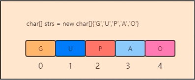

# 数据结构

## 1，数组
```java
char[] cs = new char[]{'G','U','P','A','0'};
char[] cs1 = new char[5];
cs1[0] = 'G';
...
```
特点：
- 1，内存地址连续，使用之前必须要指定数组长度
- 2，可以通过下标访问的方式访问成员，查询效率高
- 3，<span style='color:red'>增删</span>操作会给系统带来性能消耗[保证数据下标越界的问题，需要动态扩容]


