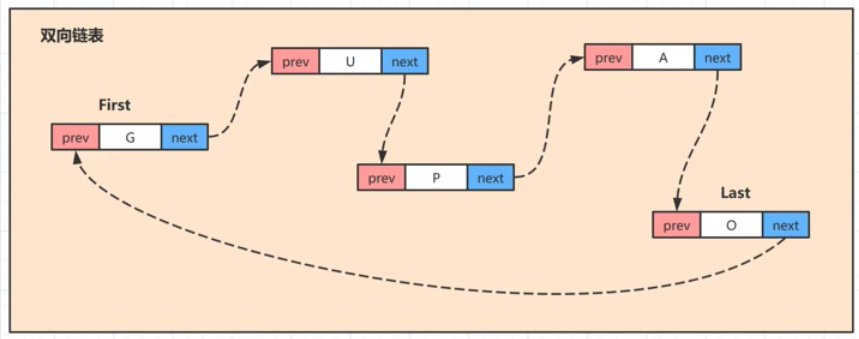

## 链表

特点：
- 1，灵活的空间要求，存储空间不要求连续
- 2，不支持下标的访问，支持顺序的遍历搜索
- 3，针对增删操作找到对应的节点改变链表的头尾指向即可，无需移动元素存储位置



LinkedList

```java
private static class Node<E> {
        E item; // 节点元素
        Node<E> next; // 下一个节点
        Node<E> prev; // 上一个节点

        Node(Node<E> prev, E element, Node<E> next) {
            this.item = element;
            this.next = next;
            this.prev = prev;
        }
    }
```