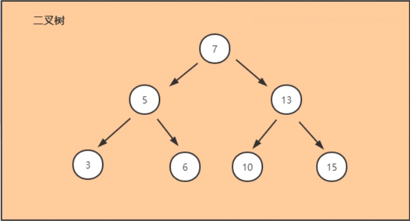
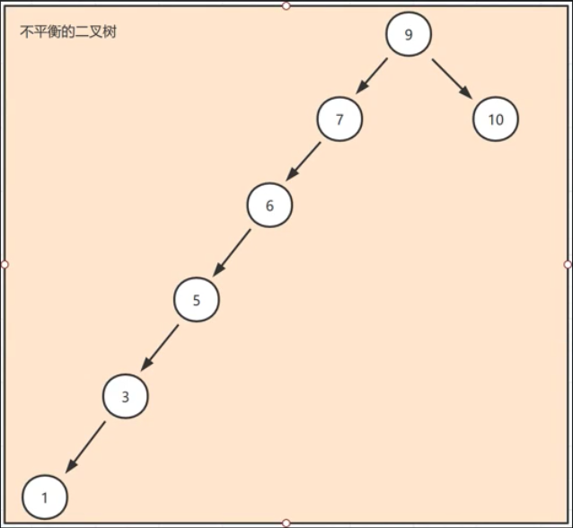

# 树

## 二叉树
```java
1，某节点的左子树节点值仅包含小于该节点值
2，某节点的右子树节点值仅包含大于该节点值
3，左右子树每个也必须是二叉查找树
4，顺序排列
```


## 树--不平衡二叉树
```java
查询效率不高

面对这个问题我们可以参考在高中学习生物时学习一个关键字去除顶端优势，通过去除植物顶端优化，侧芽会迅速生长，慢慢变得强壮和平衡，红黑树其实就是去除二叉查找树顶端优势的解决方案，从而达到树的平衡
```



