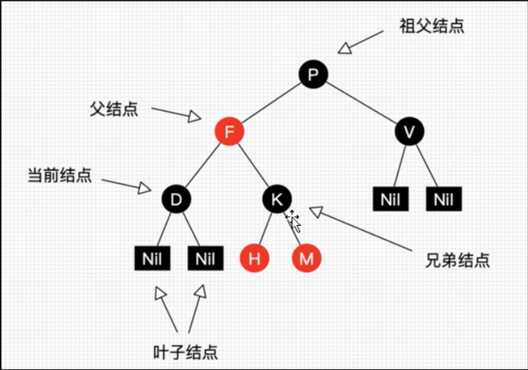
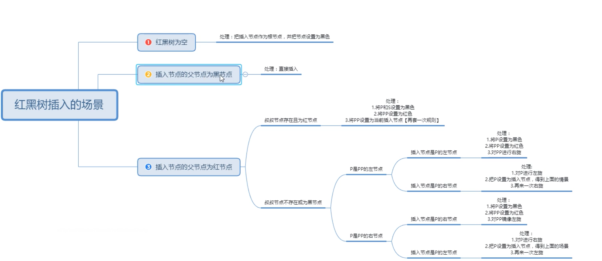

# 红黑树（Red-Black Tree RBT） 
红黑树是一个自平衡【不是绝对】的二叉树，树上的节点满足如下规则
- 每个节点要么是红色，要么黑色
- 根节点必须是黑色
- 每个叶子节点必须黑色
- 每个红色节点的两个子节点必须是黑色
- 任意节点到每个叶子节点的路径包含相同数量的黑节点

# 红黑树 - 节点描述约定
1，左旋：以某个结点作为支点（旋转节点），其右子节点变为旋转节点的父节点，右子节点的左子结点变为旋转结点的右子节点，左子节点保持不变
2，右旋：以某个结点作为支点（旋转节点），其左子节点变为旋转节点的父节点，左子节点的右子节点变为旋转节点的左子节点，右节点保持不变
3，变色：节点的颜色由红变黑或由黑变红。

